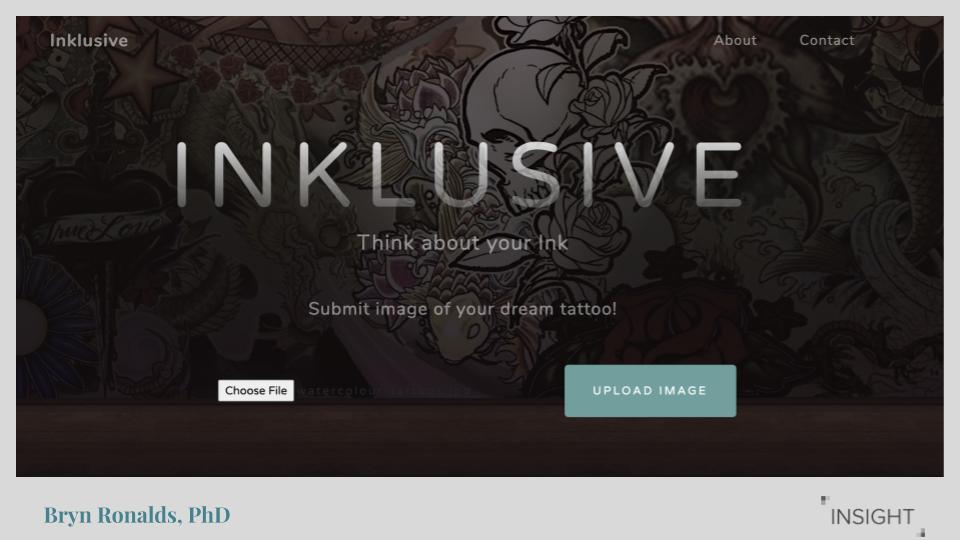
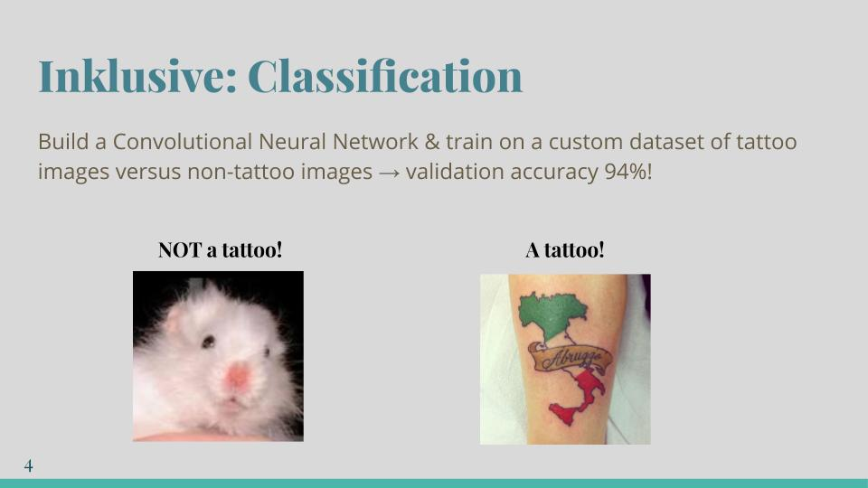
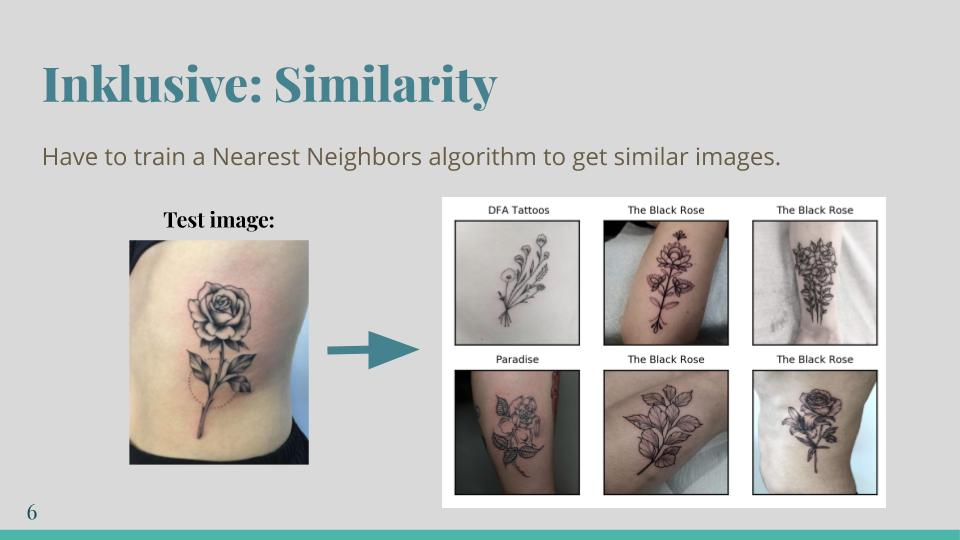

# [Inklusive](http://inklusive.xyz/): Think about your Ink

*Recommend tattoo artists based on user-submitted images and a curated list of inclusive Montreal tattoo studios*

### What is Inklusive

Inklusive works to match users with the right artists from Montreal's most loved studios. Further, it emphasizes the importance of studio atmosphere. It can often be intimidating walking into a tattoo studio, particularly for women, gender fluid and non-binary people. Being welcomed and treated with respect by the artists and studio is crucial to having a good tattoo experience. In order to achieve this, 1.2K women/female-identifying/gender fluid people were polled on facebook as to their most positive and inclusive experiences getting tattooed in Montreal. This resulted in 12 studios, all of which have 4.8+ stars on Google Reviews!

### The studios:

* [Paradise](https://www.paradisemtl.com)
* [Minuit Dix](http://minuitdixtattoo.com)
* [Tattoo 1974](https://en.tattoo1974.com)
* [Bloodline Tattoo](https://bloodlinemtl.com)
* [DFA Tattoos](https://www.dfatattoos.com)
* [Studio Artease](http://www.studioartease.com/en/)
* [Loveless](https://www.lovelesstattoo.ca)
* [Tattoo Abyss](https://tattooabyss.com)
* [Tatouage Royal](https://tatouageroyal.com)
* [Le Chalet](https://lechalettattooshop.com)
* [Saving Grace Tattoo](https://www.savinggracetattoo.com)
* [Black Rose Tattoo](https://www.theblackrosetattoo.ca)

### The images:

By scraping the Instagram pages for each of the 12 studios, I put together thousands of images. Along with the images the artist's instagram handle was also saved (only images with a single @mention were saved). From there, I had to further classify if an image was of a tattoo or not. 

In order to do this I created two custom datasets: one of tattoo images, and the other non-tattoo images (N=5254 for each). Then I built a Convolutional Neural Network with binary encoding to distinguish between the two datasets. It achieved a validation accuracy of 94%! 

Now that I had the CNN model to classify the images, I ran all of the instagram images through, storing the information of those classified as a tattoo in a Pandas dataframe. 

### Image similarity:

Next is the essence of the product: train a model to extract key features from the images, and then train a nearest neighbours model on those features. This way, when a user uploads an image, it is similarly passed through both models, with an output of *k* similar images. 

The VGG19 convolutional neural network is used for feature extraction. This 19-layer model is trained on the ImageNet LSVRC-2014 dataset, with 1.2 million training images and 1000 classification categories. When applied to the tattoo image dataset the model extracts key features, giving predictive values as to what those features represent. An sklearn NearestNeighbors algorithm is then applied to the predictions to find the most similar images.

Once the NearestNeighbors model is trained on the entire dataset it is then saved, and later applied to the user-input image.

